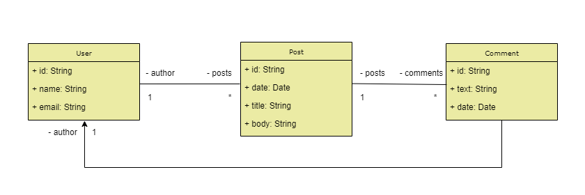

# API Rest com MongoDB
[](https://github.com/gabrielszg/springboot-mongodb/blob/master/LICENSE) 

# Sobre o projeto

API no padrão Rest para cadastro de usuários, posts, comentários e suas associações utilizando o Banco de Dados NoSQL orientado a documentos. 

# Tecnologias utilizadas
## Back end
- Java
- Spring Boot
- Spring Data
- MongoDB
- Maven

## Modelo Conceitual

  
# Como executar o projeto

## Banco de Dados
Pré-requisitos: MongoDB

```bash
# Instalar o MongoDB junto com o Mongo Compass, seguindo os passos listados na documentação
https://www.mongodb.com/docs/manual/administration/install-community/
```

## Back end
Pré-requisitos: Java 17

```bash
# clonar repositório
git clone https://github.com/gabrielszg/springboot-mongodb.git

# entrar na raiz do projeto
cd springboot-mongodb

# executar o projeto
./mvnw spring-boot:run
```

## Endpoints
Para testar utilize o Postman ou outro software semelhante de sua preferência

### Users
- GET: Buscar todos os usuários cadastrados
```bash
http://localhost:8080/users
```
- GET: Buscar usuário por ID
```bash
http://localhost:8080/users/{id}
```
- POST: Inserir usuário
```bash
http://localhost:8080/users

# Passar o usuário no corpo da requisição em formato JSON, exemplo
{
    "name": "teste",
    "email": "teste@gmail.com"
}
```
- DELETE: Remover usuário por ID
```bash
http://localhost:8080/users/{id}
```
- PUT: Atualizar usuário por ID
```bash
http://localhost:8080/users/{id}
```
- GET: Buscar os posts e comentários do usuário por ID
```bash
http://localhost:8080/users/{id}/posts
```

### Posts
- GET: Buscar posts por ID
```bash
http://localhost:8080/posts/{id}
```
- GET: Buscar posts pelo título
```bash
http://localhost:8080/posts/titlesearch?text=<título>
```
- GET: Buscar posts por palavras que estejam no conteúdo, podendo definir data mínima e máxima das postagens
```bash
http://localhost:8080/posts/fullsearch?text=<palavra>&minDate=<data mínima>&maxDate=<data máxima>
```

# Autor

@gabrielszg
